# Public API Skeleton - 시퀀스 다이어그램

> 이 문서는 인증/인가 시스템의 모든 기능에 대한 상세 시퀀스 다이어그램을 제공합니다.

## 목차

- [Phase 1: 기본 인증 (MVP)](#phase-1-기본-인증-mvp)
  - [1.1 회원가입](#11-회원가입)
  - [1.2 로그인](#12-로그인)
  - [1.2a 로그인 2단계 (2차 인증)](#12a-로그인-2단계-2차-인증)
  - [1.3 토큰 갱신](#13-토큰-갱신)
  - [1.4 로그아웃](#14-로그아웃)
  - [1.5 API 요청 인증](#15-api-요청-인증)
- [Phase 2: 소셜 로그인](#phase-2-소셜-로그인)
  - [2.1 소셜 로그인 시작](#21-소셜-로그인-시작)
  - [2.2 소셜 로그인 콜백](#22-소셜-로그인-콜백)
  - [2.3 소셜 계정 연동](#23-소셜-계정-연동)
  - [2.4 소셜 계정 연동 해제](#24-소셜-계정-연동-해제)
- [Phase 3: 그룹 기반 권한 관리](#phase-3-그룹-기반-권한-관리)
  - [3.1 사용자 권한 조회](#31-사용자-권한-조회)
  - [3.2 그룹 할당](#32-그룹-할당)
  - [3.3 그룹 권한 설정](#33-그룹-권한-설정)
  - [3.4 권한 기반 API 접근 제어](#34-권한-기반-api-접근-제어)
- [Phase 4: OAuth2 Authorization Server](#phase-4-oauth2-authorization-server)
  - [4.1 Authorization Code Flow](#41-authorization-code-flow)
  - [4.2 Client Credentials Flow](#42-client-credentials-flow)
  - [4.3 Token Introspection](#43-token-introspection)
- [Phase 5: 보안 강화 및 감사](#phase-5-보안-강화-및-감사)
  - [5.1 OIDC UserInfo](#51-oidc-userinfo)
  - [5.2 JWK Set 조회](#52-jwk-set-조회)
  - [5.3 감사 로그 기록](#53-감사-로그-기록)
  - [5.4 로그인 시도 제한](#54-로그인-시도-제한)
  - [5.5 IP 차단](#55-ip-차단)
  - [5.6 사용자 프로필 관리](#56-사용자-프로필-관리)
  - [5.7 비밀번호 변경](#57-비밀번호-변경)
  - [5.8 세션 관리](#58-세션-관리)

---

## 레이어드 아키텍처 개요

모든 API는 다음 계층 구조를 따릅니다:

```
┌─────────────────────────────────────────────────────────────────┐
│                        Controller                                │
│  - HTTP 요청/응답 처리 — MappingService 만 주입, 응답은 Model      │
└─────────────────────────────────────────────────────────────────┘
                              │
                              ▼
┌─────────────────────────────────────────────────────────────────┐
│                      MappingService                              │
│  - DTO ↔ Model 변환 (MapStruct), BizService 호출                 │
└─────────────────────────────────────────────────────────────────┘
                              │
                              ▼
┌─────────────────────────────────────────────────────────────────┐
│                        BizService                                │
│  - 비즈니스 로직, 트랜잭션 관리, DTO 사용 — Repository 직접 주입 금지│
│  - 외부 API 는 client/ 의 ~Client 로                              │
└─────────────────────────────────────────────────────────────────┘
                              │
                              ▼
┌─────────────────────────────────────────────────────────────────┐
│                      EntityService                               │
│  - Entity ↔ DTO 변환, Repository 호출, 캐싱 — Entity 는 여기까지  │
└─────────────────────────────────────────────────────────────────┘
                              │
                              ▼
┌─────────────────────────────────────────────────────────────────┐
│                        Repository                                │
│  - JPA/JDBC 데이터 접근                                          │
└─────────────────────────────────────────────────────────────────┘
```

---

## Phase 1: 기본 인증 (MVP)

### 1.1 회원가입

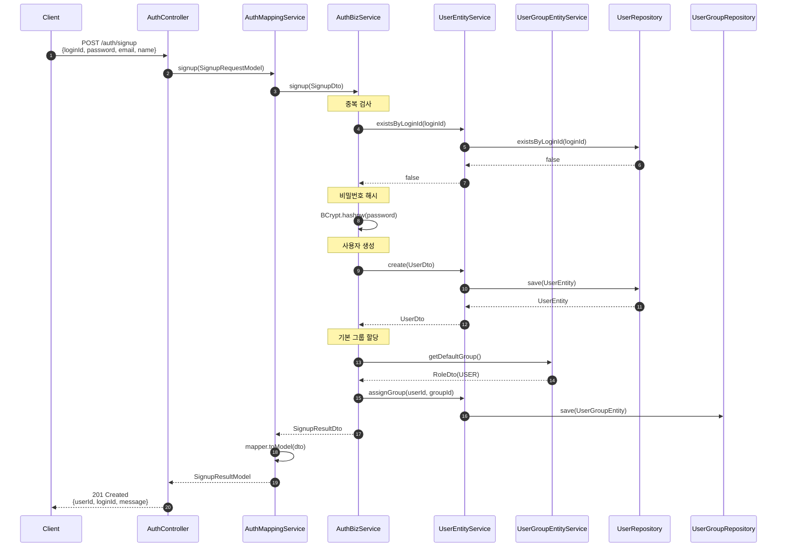
```mermaid
sequenceDiagram
    autonumber
    participant Client
    participant AuthController
    participant AuthMappingService
    participant AuthBizService
    participant UserEntityService
    participant UserGroupEntityService
    participant UserRepository
    participant UserGroupRepository

    Client->>AuthController: POST /auth/signup<br/>{loginId, password, email, name}
    AuthController->>AuthMappingService: signup(SignupRequestModel)
    AuthMappingService->>AuthBizService: signup(SignupDto)

    Note over AuthBizService: 중복 검사
    AuthBizService->>UserEntityService: existsByLoginId(loginId)
    UserEntityService->>UserRepository: existsByLoginId(loginId)
    UserRepository-->>UserEntityService: false
    UserEntityService-->>AuthBizService: false

    Note over AuthBizService: 비밀번호 해시
    AuthBizService->>AuthBizService: BCrypt.hashpw(password)

    Note over AuthBizService: 사용자 생성
    AuthBizService->>UserEntityService: create(UserDto)
    UserEntityService->>UserRepository: save(UserEntity)
    UserRepository-->>UserEntityService: UserEntity
    UserEntityService-->>AuthBizService: UserDto

    Note over AuthBizService: 기본 그룹 할당
    AuthBizService->>UserGroupEntityService: getDefaultGroup()
    UserGroupEntityService-->>AuthBizService: RoleDto(USER)
    AuthBizService->>UserEntityService: assignGroup(userId, groupId)
    UserEntityService->>UserGroupRepository: save(UserGroupEntity)

    AuthBizService-->>AuthMappingService: SignupResultDto
    AuthMappingService->>AuthMappingService: mapper.toModel(dto)
    AuthMappingService-->>AuthController: SignupResultModel
    AuthController-->>Client: 201 Created<br/>{userId, loginId, message}
```

### 1.2 로그인

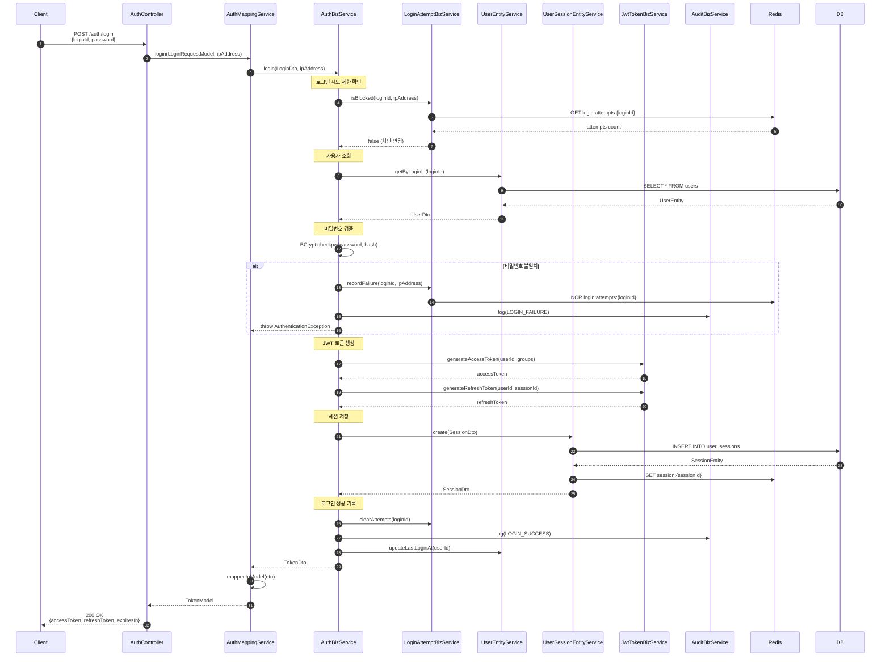
```mermaid
sequenceDiagram
    autonumber
    participant Client
    participant AuthController
    participant AuthMappingService
    participant AuthBizService
    participant LoginAttemptBizService
    participant UserEntityService
    participant UserSessionEntityService
    participant JwtTokenBizService
    participant AuditBizService
    participant Redis
    participant DB

    Client->>AuthController: POST /auth/login<br/>{loginId, password}
    AuthController->>AuthMappingService: login(LoginRequestModel, ipAddress)
    AuthMappingService->>AuthBizService: login(LoginDto, ipAddress)

    Note over AuthBizService: 로그인 시도 제한 확인
    AuthBizService->>LoginAttemptBizService: isBlocked(loginId, ipAddress)
    LoginAttemptBizService->>Redis: GET login:attempts:{loginId}
    Redis-->>LoginAttemptBizService: attempts count
    LoginAttemptBizService-->>AuthBizService: false (차단 안됨)

    Note over AuthBizService: 사용자 조회
    AuthBizService->>UserEntityService: getByLoginId(loginId)
    UserEntityService->>DB: SELECT * FROM users
    DB-->>UserEntityService: UserEntity
    UserEntityService-->>AuthBizService: UserDto

    Note over AuthBizService: 비밀번호 검증
    AuthBizService->>AuthBizService: BCrypt.checkpw(password, hash)

    alt 비밀번호 불일치
        AuthBizService->>LoginAttemptBizService: recordFailure(loginId, ipAddress)
        LoginAttemptBizService->>Redis: INCR login:attempts:{loginId}
        AuthBizService->>AuditBizService: log(LOGIN_FAILURE)
        AuthBizService-->>AuthMappingService: throw AuthenticationException
    end

    Note over AuthBizService: JWT 토큰 생성
    AuthBizService->>JwtTokenBizService: generateAccessToken(userId, groups)
    JwtTokenBizService-->>AuthBizService: accessToken
    AuthBizService->>JwtTokenBizService: generateRefreshToken(userId, sessionId)
    JwtTokenBizService-->>AuthBizService: refreshToken

    Note over AuthBizService: 세션 저장
    AuthBizService->>UserSessionEntityService: create(SessionDto)
    UserSessionEntityService->>DB: INSERT INTO user_sessions
    DB-->>UserSessionEntityService: SessionEntity
    UserSessionEntityService->>Redis: SET session:{sessionId}
    UserSessionEntityService-->>AuthBizService: SessionDto

    Note over AuthBizService: 로그인 성공 기록
    AuthBizService->>LoginAttemptBizService: clearAttempts(loginId)
    AuthBizService->>AuditBizService: log(LOGIN_SUCCESS)
    AuthBizService->>UserEntityService: updateLastLoginAt(userId)

    AuthBizService-->>AuthMappingService: TokenDto
    AuthMappingService->>AuthMappingService: mapper.toModel(dto)
    AuthMappingService-->>AuthController: TokenModel
    AuthController-->>Client: 200 OK<br/>{accessToken, refreshToken, expiresIn}
```

### 1.2a 로그인 2단계 (2차 인증)

2차 인증을 켠 계정은 1단계(비밀번호·소셜)를 통과해도 **세션을 만들지 않는다**. 대기 상태는 Redis challenge 하나뿐이다(API·브라우저 공통). 브라우저는 세션에 challenge 토큰 문자열만 두고 `/auth/mfa` 화면을 거친다.

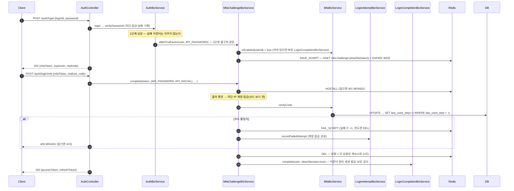
```mermaid
sequenceDiagram
    autonumber
    participant Client
    participant AuthController
    participant AuthBizService
    participant MfaChallengeBizService
    participant MfaBizService
    participant LoginAttemptBizService
    participant LoginCompletionBizService
    participant Redis
    participant DB

    Client->>AuthController: POST /auth/login {loginId, password}
    AuthController->>AuthBizService: login → verifyPassword (차단·잠금·실패 기록)
    Note over AuthBizService: 1단계 성공 — 실패 카운터는 지우지 않는다
    AuthBizService->>MfaChallengeBizService: afterFirstFactor(user, API_PASSWORD) — 1단계 출구의 관문
    MfaChallengeBizService->>MfaBizService: isEnabled(userId) = true (꺼져 있으면 바로 LoginCompletionBizService)
    MfaChallengeBizService->>Redis: SAVE_SCRIPT — HSET mfa:challenge:{sha256(token)} + EXPIRE 300초
    AuthController-->>Client: 202 {mfaToken, expiresIn, methods}

    Client->>AuthController: POST /auth/login/mfa {mfaToken, method, code}
    AuthController->>MfaChallengeBizService: complete(token, {API_PASSWORD, API_SOCIAL}, …)
    MfaChallengeBizService->>Redis: HGETALL (없으면 401 MFA002)
    Note over MfaChallengeBizService: 출처 확인 → 차단 IP·계정 잠금(코드 보기 전)
    MfaChallengeBizService->>MfaBizService: verifyCode
    MfaBizService->>DB: UPDATE … SET last_used_step=:s WHERE last_used_step < :s
    alt 코드 불일치
        MfaChallengeBizService->>Redis: FAIL_SCRIPT (실패 수 +1, 한도면 DEL)
        MfaChallengeBizService->>LoginAttemptBizService: recordFailedAttempt (계정 잠금 공유)
        AuthController-->>Client: 400 MFA001 (잠기면 423)
    end
    MfaChallengeBizService->>Redis: DEL — 반환 1 인 요청만 계속(1회 소비)
    MfaChallengeBizService->>LoginCompletionBizService: complete(user, clearAttempts=true) — 카운터 정리·세션 발급·성공 감사
    AuthController-->>Client: 200 {accessToken, refreshToken}
```

브라우저: `POST /oauth2/login`(또는 소셜 콜백)이 challenge 를 만들면 `MfaPendingTokenStore.begin` 이 토큰을 두고 세션 ID 를 바꾼 뒤 `302 /auth/mfa`. `POST /auth/mfa`(CSRF)가 `complete(token, {AUTHORIZE, SOCIAL_BROWSER}, …)` 를 지나면 그때 브라우저 세션에 로그인시키고, 인가 서버 출처는 기다리던 authorize 로, 소셜 출처는 토큰을 교환 대기에 맡긴 뒤 `/demo/auth/callback` 으로 보낸다. 2단계 전에는 SecurityContext 가 없어 `/oauth2/authorize` 는 로그인 화면으로 보낸다.

### 1.3 토큰 갱신

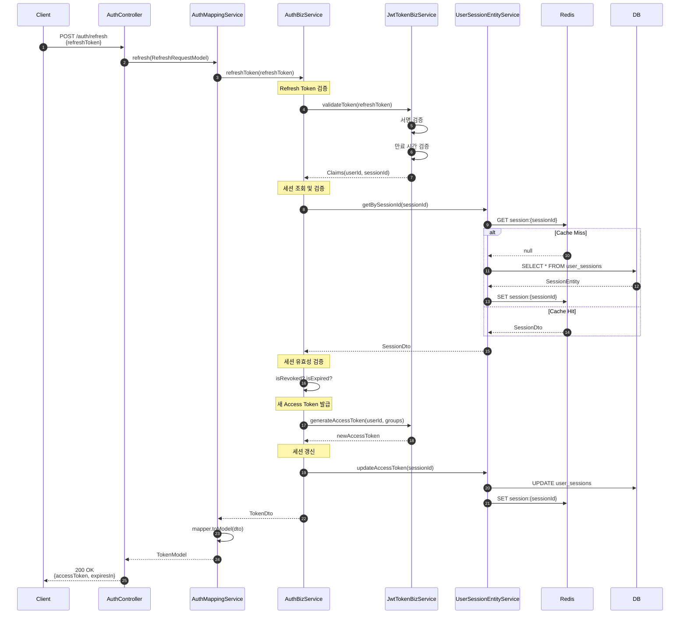
```mermaid
sequenceDiagram
    autonumber
    participant Client
    participant AuthController
    participant AuthMappingService
    participant AuthBizService
    participant JwtTokenBizService
    participant UserSessionEntityService
    participant Redis
    participant DB

    Client->>AuthController: POST /auth/refresh<br/>{refreshToken}
    AuthController->>AuthMappingService: refresh(RefreshRequestModel)
    AuthMappingService->>AuthBizService: refreshToken(refreshToken)

    Note over AuthBizService: Refresh Token 검증
    AuthBizService->>JwtTokenBizService: validateToken(refreshToken)
    JwtTokenBizService->>JwtTokenBizService: 서명 검증
    JwtTokenBizService->>JwtTokenBizService: 만료 시간 검증
    JwtTokenBizService-->>AuthBizService: Claims(userId, sessionId)

    Note over AuthBizService: 세션 조회 및 검증
    AuthBizService->>UserSessionEntityService: getBySessionId(sessionId)
    UserSessionEntityService->>Redis: GET session:{sessionId}

    alt Cache Miss
        Redis-->>UserSessionEntityService: null
        UserSessionEntityService->>DB: SELECT * FROM user_sessions
        DB-->>UserSessionEntityService: SessionEntity
        UserSessionEntityService->>Redis: SET session:{sessionId}
    else Cache Hit
        Redis-->>UserSessionEntityService: SessionDto
    end

    UserSessionEntityService-->>AuthBizService: SessionDto

    Note over AuthBizService: 세션 유효성 검증
    AuthBizService->>AuthBizService: isRevoked? isExpired?

    Note over AuthBizService: 새 Access Token 발급
    AuthBizService->>JwtTokenBizService: generateAccessToken(userId, groups)
    JwtTokenBizService-->>AuthBizService: newAccessToken

    Note over AuthBizService: 세션 갱신
    AuthBizService->>UserSessionEntityService: updateAccessToken(sessionId)
    UserSessionEntityService->>DB: UPDATE user_sessions
    UserSessionEntityService->>Redis: SET session:{sessionId}

    AuthBizService-->>AuthMappingService: TokenDto
    AuthMappingService->>AuthMappingService: mapper.toModel(dto)
    AuthMappingService-->>AuthController: TokenModel
    AuthController-->>Client: 200 OK<br/>{accessToken, expiresIn}
```

### 1.4 로그아웃

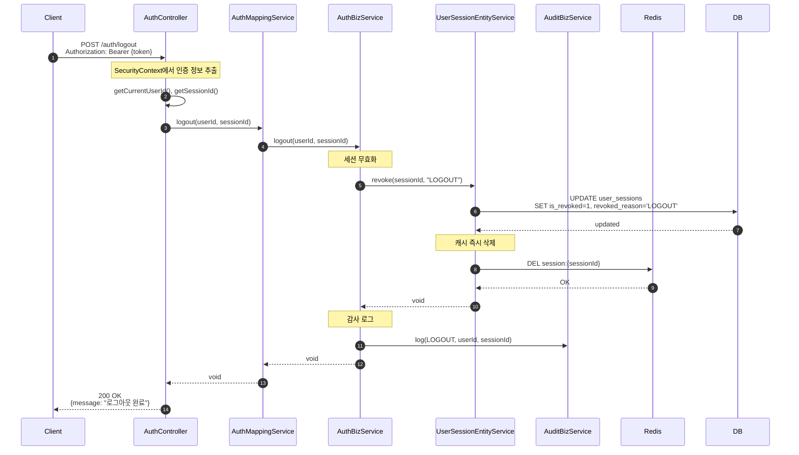
```mermaid
sequenceDiagram
    autonumber
    participant Client
    participant AuthController
    participant AuthMappingService
    participant AuthBizService
    participant UserSessionEntityService
    participant AuditBizService
    participant Redis
    participant DB

    Client->>AuthController: POST /auth/logout<br/>Authorization: Bearer {token}

    Note over AuthController: SecurityContext에서 인증 정보 추출
    AuthController->>AuthController: getCurrentUserId(), getSessionId()

    AuthController->>AuthMappingService: logout(userId, sessionId)
    AuthMappingService->>AuthBizService: logout(userId, sessionId)

    Note over AuthBizService: 세션 무효화
    AuthBizService->>UserSessionEntityService: revoke(sessionId, "LOGOUT")
    UserSessionEntityService->>DB: UPDATE user_sessions<br/>SET is_revoked=1, revoked_reason='LOGOUT'
    DB-->>UserSessionEntityService: updated

    Note over UserSessionEntityService: 캐시 즉시 삭제
    UserSessionEntityService->>Redis: DEL session:{sessionId}
    Redis-->>UserSessionEntityService: OK

    UserSessionEntityService-->>AuthBizService: void

    Note over AuthBizService: 감사 로그
    AuthBizService->>AuditBizService: log(LOGOUT, userId, sessionId)

    AuthBizService-->>AuthMappingService: void
    AuthMappingService-->>AuthController: void
    AuthController-->>Client: 200 OK<br/>{message: "로그아웃 완료"}
```

### 1.5 API 요청 인증

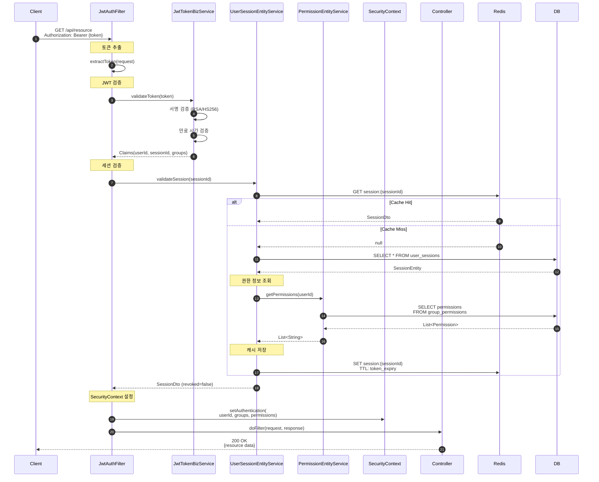
```mermaid
sequenceDiagram
    autonumber
    participant Client
    participant JwtAuthFilter
    participant JwtTokenBizService
    participant UserSessionEntityService
    participant PermissionEntityService
    participant SecurityContext
    participant Controller
    participant Redis
    participant DB

    Client->>JwtAuthFilter: GET /api/resource<br/>Authorization: Bearer {token}

    Note over JwtAuthFilter: 토큰 추출
    JwtAuthFilter->>JwtAuthFilter: extractToken(request)

    Note over JwtAuthFilter: JWT 검증
    JwtAuthFilter->>JwtTokenBizService: validateToken(token)
    JwtTokenBizService->>JwtTokenBizService: 서명 검증 (RSA/HS256)
    JwtTokenBizService->>JwtTokenBizService: 만료 시간 검증
    JwtTokenBizService-->>JwtAuthFilter: Claims(userId, sessionId, groups)

    Note over JwtAuthFilter: 세션 검증
    JwtAuthFilter->>UserSessionEntityService: validateSession(sessionId)
    UserSessionEntityService->>Redis: GET session:{sessionId}

    alt Cache Hit
        Redis-->>UserSessionEntityService: SessionDto
    else Cache Miss
        Redis-->>UserSessionEntityService: null
        UserSessionEntityService->>DB: SELECT * FROM user_sessions
        DB-->>UserSessionEntityService: SessionEntity

        Note over UserSessionEntityService: 권한 정보 조회
        UserSessionEntityService->>PermissionEntityService: getPermissions(userId)
        PermissionEntityService->>DB: SELECT permissions<br/>FROM group_permissions
        DB-->>PermissionEntityService: List<Permission>
        PermissionEntityService-->>UserSessionEntityService: List<String>

        Note over UserSessionEntityService: 캐시 저장
        UserSessionEntityService->>Redis: SET session:{sessionId}<br/>TTL: token_expiry
    end

    UserSessionEntityService-->>JwtAuthFilter: SessionDto (revoked=false)

    Note over JwtAuthFilter: SecurityContext 설정
    JwtAuthFilter->>SecurityContext: setAuthentication(<br/>userId, groups, permissions)

    JwtAuthFilter->>Controller: doFilter(request, response)
    Controller-->>Client: 200 OK<br/>{resource data}
```

---

## Phase 2: 소셜 로그인

### 2.1 소셜 로그인 시작

브라우저가 이 경로로 직접 이동한다. 브라우저 체인(세션·CSRF)을 탄다.

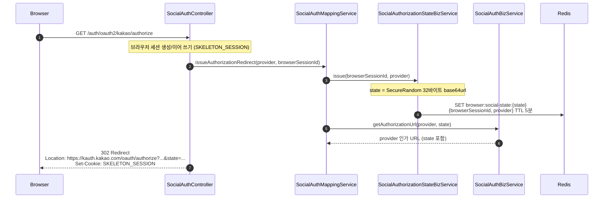
```mermaid
sequenceDiagram
    autonumber
    participant Browser
    participant SocialAuthController
    participant SocialAuthMappingService
    participant SocialAuthorizationStateBizService
    participant SocialAuthBizService
    participant Redis

    Browser->>SocialAuthController: GET /auth/oauth2/kakao/authorize
    Note over SocialAuthController: 브라우저 세션 생성/이어 쓰기 (SKELETON_SESSION)
    SocialAuthController->>SocialAuthMappingService: issueAuthorizationRedirect(provider, browserSessionId)
    SocialAuthMappingService->>SocialAuthorizationStateBizService: issue(browserSessionId, provider)
    Note over SocialAuthorizationStateBizService: state = SecureRandom 32바이트 base64url
    SocialAuthorizationStateBizService->>Redis: SET browser:social-state:{state}<br/>{browserSessionId, provider} TTL 5분
    SocialAuthMappingService->>SocialAuthBizService: getAuthorizationUrl(provider, state)
    SocialAuthBizService-->>SocialAuthMappingService: provider 인가 URL (state 포함)
    SocialAuthController-->>Browser: 302 Redirect<br/>Location: https://kauth.kakao.com/oauth/authorize?...&state=...<br/>Set-Cookie: SKELETON_SESSION
```

### 2.2 소셜 로그인 콜백

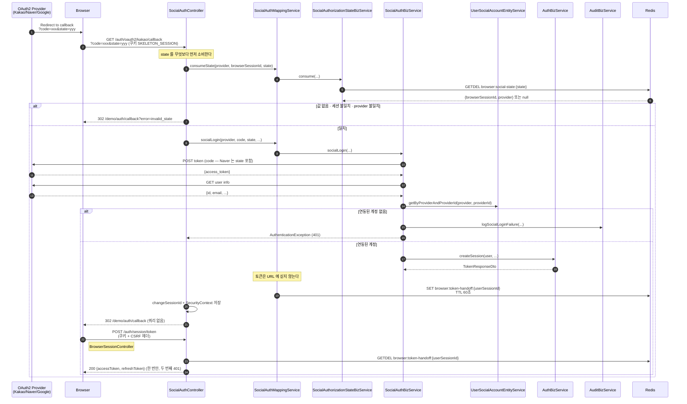
```mermaid
sequenceDiagram
    autonumber
    participant Provider as OAuth2 Provider<br/>(Kakao/Naver/Google)
    participant Browser
    participant SocialAuthController
    participant SocialAuthMappingService
    participant SocialAuthorizationStateBizService
    participant SocialAuthBizService
    participant UserSocialAccountEntityService
    participant AuthBizService
    participant AuditBizService
    participant Redis

    Provider->>Browser: Redirect to callback<br/>?code=xxx&state=yyy
    Browser->>SocialAuthController: GET /auth/oauth2/kakao/callback<br/>?code=xxx&state=yyy (쿠키 SKELETON_SESSION)

    Note over SocialAuthController: state 를 무엇보다 먼저 소비한다
    SocialAuthController->>SocialAuthMappingService: consumeState(provider, browserSessionId, state)
    SocialAuthMappingService->>SocialAuthorizationStateBizService: consume(...)
    SocialAuthorizationStateBizService->>Redis: GETDEL browser:social-state:{state}
    Redis-->>SocialAuthorizationStateBizService: {browserSessionId, provider} 또는 null

    alt 값 없음 · 세션 불일치 · provider 불일치
        SocialAuthController-->>Browser: 302 /demo/auth/callback?error=invalid_state
    else 일치
        SocialAuthController->>SocialAuthMappingService: socialLogin(provider, code, state, ...)
        SocialAuthMappingService->>SocialAuthBizService: socialLogin(...)
        SocialAuthBizService->>Provider: POST token (code — Naver 는 state 포함)
        Provider-->>SocialAuthBizService: {access_token}
        SocialAuthBizService->>Provider: GET user info
        Provider-->>SocialAuthBizService: {id, email, ...}
        SocialAuthBizService->>UserSocialAccountEntityService: getByProviderAndProviderId(provider, providerId)
        alt 연동된 계정 없음
            SocialAuthBizService->>AuditBizService: logSocialLoginFailure(...)
            SocialAuthBizService-->>SocialAuthController: AuthenticationException (401)
        else 연동된 계정
            SocialAuthBizService->>AuthBizService: createSession(user, ...)
            AuthBizService-->>SocialAuthBizService: TokenResponseDto
            Note over SocialAuthMappingService: 토큰은 URL 에 싣지 않는다
            SocialAuthMappingService->>Redis: SET browser:token-handoff:{userSessionId}<br/>TTL 60초
            SocialAuthController->>SocialAuthController: changeSessionId + SecurityContext 저장
            SocialAuthController-->>Browser: 302 /demo/auth/callback (쿼리 없음)
            Browser->>SocialAuthController: POST /auth/session/token<br/>(쿠키 + CSRF 헤더)
            Note right of Browser: BrowserSessionController
            SocialAuthController->>Redis: GETDEL browser:token-handoff:{userSessionId}
            SocialAuthController-->>Browser: 200 {accessToken, refreshToken} (한 번만, 두 번째 401)
        end
    end
```

### 2.3 소셜 계정 연동

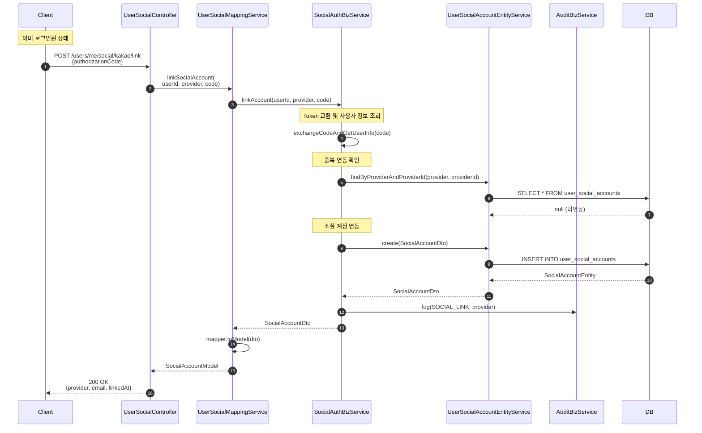
```mermaid
sequenceDiagram
    autonumber
    participant Client
    participant UserSocialController
    participant UserSocialMappingService
    participant SocialAuthBizService
    participant UserSocialAccountEntityService
    participant AuditBizService
    participant DB

    Note over Client: 이미 로그인된 상태
    Client->>UserSocialController: POST /users/me/social/kakao/link<br/>{authorizationCode}

    UserSocialController->>UserSocialMappingService: linkSocialAccount(<br/>userId, provider, code)
    UserSocialMappingService->>SocialAuthBizService: linkAccount(userId, provider, code)

    Note over SocialAuthBizService: Token 교환 및 사용자 정보 조회
    SocialAuthBizService->>SocialAuthBizService: exchangeCodeAndGetUserInfo(code)

    Note over SocialAuthBizService: 중복 연동 확인
    SocialAuthBizService->>UserSocialAccountEntityService: findByProviderAndProviderId(provider, providerId)
    UserSocialAccountEntityService->>DB: SELECT * FROM user_social_accounts
    DB-->>UserSocialAccountEntityService: null (미연동)

    Note over SocialAuthBizService: 소셜 계정 연동
    SocialAuthBizService->>UserSocialAccountEntityService: create(SocialAccountDto)
    UserSocialAccountEntityService->>DB: INSERT INTO user_social_accounts
    DB-->>UserSocialAccountEntityService: SocialAccountEntity
    UserSocialAccountEntityService-->>SocialAuthBizService: SocialAccountDto

    SocialAuthBizService->>AuditBizService: log(SOCIAL_LINK, provider)

    SocialAuthBizService-->>UserSocialMappingService: SocialAccountDto
    UserSocialMappingService->>UserSocialMappingService: mapper.toModel(dto)
    UserSocialMappingService-->>UserSocialController: SocialAccountModel
    UserSocialController-->>Client: 200 OK<br/>{provider, email, linkedAt}
```

### 2.4 소셜 계정 연동 해제

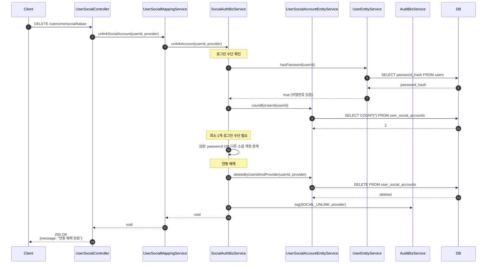
```mermaid
sequenceDiagram
    autonumber
    participant Client
    participant UserSocialController
    participant UserSocialMappingService
    participant SocialAuthBizService
    participant UserSocialAccountEntityService
    participant UserEntityService
    participant AuditBizService
    participant DB

    Client->>UserSocialController: DELETE /users/me/social/kakao
    UserSocialController->>UserSocialMappingService: unlinkSocialAccount(userId, provider)
    UserSocialMappingService->>SocialAuthBizService: unlinkAccount(userId, provider)

    Note over SocialAuthBizService: 로그인 수단 확인
    SocialAuthBizService->>UserEntityService: hasPassword(userId)
    UserEntityService->>DB: SELECT password_hash FROM users
    DB-->>UserEntityService: password_hash
    UserEntityService-->>SocialAuthBizService: true (비밀번호 있음)

    SocialAuthBizService->>UserSocialAccountEntityService: countByUserId(userId)
    UserSocialAccountEntityService->>DB: SELECT COUNT(*) FROM user_social_accounts
    DB-->>UserSocialAccountEntityService: 2

    Note over SocialAuthBizService: 최소 1개 로그인 수단 필요
    SocialAuthBizService->>SocialAuthBizService: 검증: password OR 다른 소셜 계정 존재

    Note over SocialAuthBizService: 연동 해제
    SocialAuthBizService->>UserSocialAccountEntityService: deleteByUserIdAndProvider(userId, provider)
    UserSocialAccountEntityService->>DB: DELETE FROM user_social_accounts
    DB-->>UserSocialAccountEntityService: deleted

    SocialAuthBizService->>AuditBizService: log(SOCIAL_UNLINK, provider)

    SocialAuthBizService-->>UserSocialMappingService: void
    UserSocialMappingService-->>UserSocialController: void
    UserSocialController-->>Client: 200 OK<br/>{message: "연동 해제 완료"}
```

---

## Phase 3: 그룹 기반 권한 관리

### 3.1 사용자 권한 조회

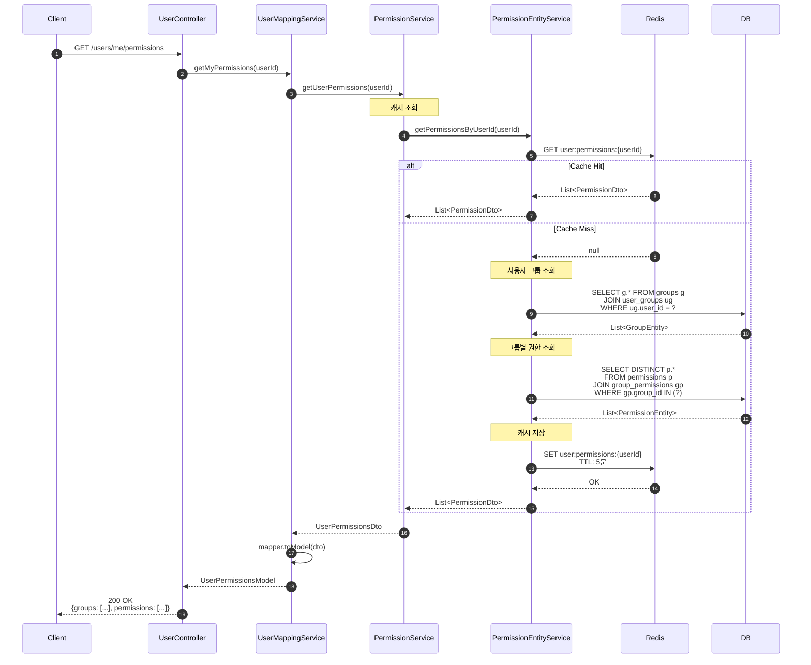
```mermaid
sequenceDiagram
    autonumber
    participant Client
    participant UserController
    participant UserMappingService
    participant PermissionService
    participant PermissionEntityService
    participant Redis
    participant DB

    Client->>UserController: GET /users/me/permissions
    UserController->>UserMappingService: getMyPermissions(userId)
    UserMappingService->>PermissionService: getUserPermissions(userId)

    Note over PermissionService: 캐시 조회
    PermissionService->>PermissionEntityService: getPermissionsByUserId(userId)
    PermissionEntityService->>Redis: GET user:permissions:{userId}

    alt Cache Hit
        Redis-->>PermissionEntityService: List<PermissionDto>
        PermissionEntityService-->>PermissionService: List<PermissionDto>
    else Cache Miss
        Redis-->>PermissionEntityService: null

        Note over PermissionEntityService: 사용자 그룹 조회
        PermissionEntityService->>DB: SELECT g.* FROM groups g<br/>JOIN user_groups ug<br/>WHERE ug.user_id = ?
        DB-->>PermissionEntityService: List<GroupEntity>

        Note over PermissionEntityService: 그룹별 권한 조회
        PermissionEntityService->>DB: SELECT DISTINCT p.*<br/>FROM permissions p<br/>JOIN group_permissions gp<br/>WHERE gp.group_id IN (?)
        DB-->>PermissionEntityService: List<PermissionEntity>

        Note over PermissionEntityService: 캐시 저장
        PermissionEntityService->>Redis: SET user:permissions:{userId}<br/>TTL: 5분
        Redis-->>PermissionEntityService: OK

        PermissionEntityService-->>PermissionService: List<PermissionDto>
    end

    PermissionService-->>UserMappingService: UserPermissionsDto
    UserMappingService->>UserMappingService: mapper.toModel(dto)
    UserMappingService-->>UserController: UserPermissionsModel
    UserController-->>Client: 200 OK<br/>{groups: [...], permissions: [...]}
```

### 3.2 그룹 할당

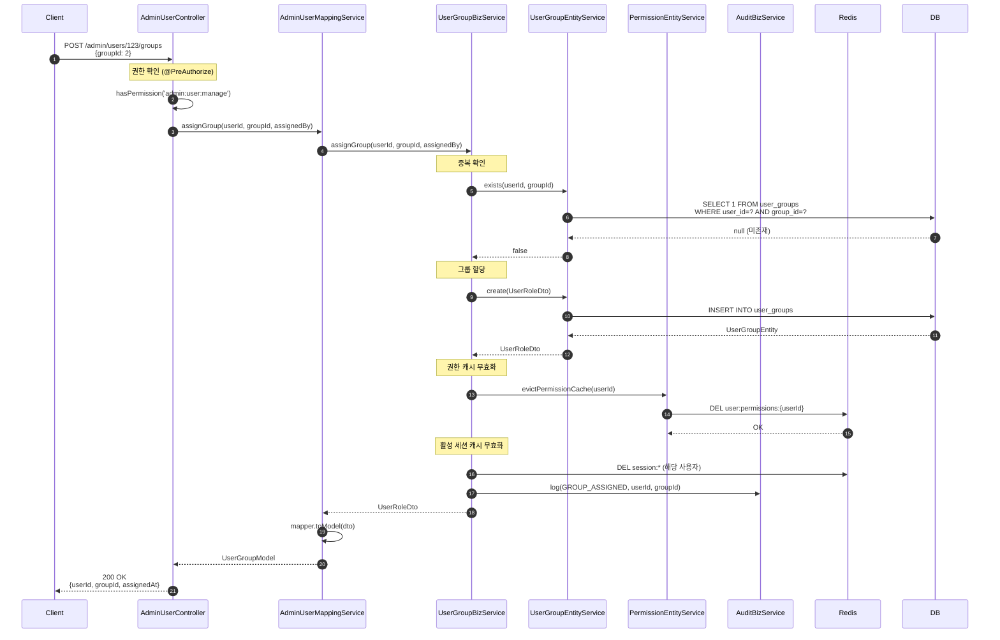
```mermaid
sequenceDiagram
    autonumber
    participant Client
    participant AdminUserController
    participant AdminUserMappingService
    participant UserGroupBizService
    participant UserGroupEntityService
    participant PermissionEntityService
    participant AuditBizService
    participant Redis
    participant DB

    Client->>AdminUserController: POST /admin/users/123/groups<br/>{groupId: 2}

    Note over AdminUserController: 권한 확인 (@PreAuthorize)
    AdminUserController->>AdminUserController: hasPermission('admin:user:manage')

    AdminUserController->>AdminUserMappingService: assignGroup(userId, groupId, assignedBy)
    AdminUserMappingService->>UserGroupBizService: assignGroup(userId, groupId, assignedBy)

    Note over UserGroupBizService: 중복 확인
    UserGroupBizService->>UserGroupEntityService: exists(userId, groupId)
    UserGroupEntityService->>DB: SELECT 1 FROM user_groups<br/>WHERE user_id=? AND group_id=?
    DB-->>UserGroupEntityService: null (미존재)
    UserGroupEntityService-->>UserGroupBizService: false

    Note over UserGroupBizService: 그룹 할당
    UserGroupBizService->>UserGroupEntityService: create(UserRoleDto)
    UserGroupEntityService->>DB: INSERT INTO user_groups
    DB-->>UserGroupEntityService: UserGroupEntity
    UserGroupEntityService-->>UserGroupBizService: UserRoleDto

    Note over UserGroupBizService: 권한 캐시 무효화
    UserGroupBizService->>PermissionEntityService: evictPermissionCache(userId)
    PermissionEntityService->>Redis: DEL user:permissions:{userId}
    Redis-->>PermissionEntityService: OK

    Note over UserGroupBizService: 활성 세션 캐시 무효화
    UserGroupBizService->>Redis: DEL session:* (해당 사용자)

    UserGroupBizService->>AuditBizService: log(GROUP_ASSIGNED, userId, groupId)

    UserGroupBizService-->>AdminUserMappingService: UserRoleDto
    AdminUserMappingService->>AdminUserMappingService: mapper.toModel(dto)
    AdminUserMappingService-->>AdminUserController: UserGroupModel
    AdminUserController-->>Client: 200 OK<br/>{userId, groupId, assignedAt}
```

### 3.3 그룹 권한 설정

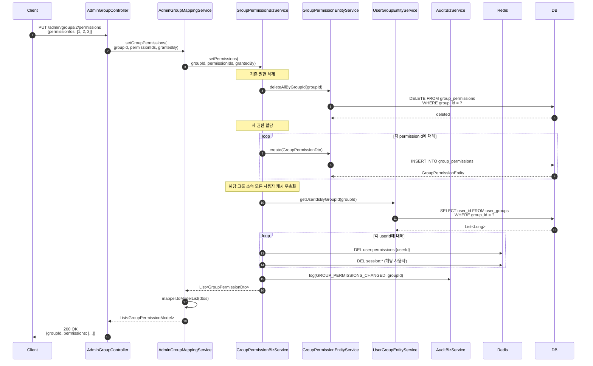
```mermaid
sequenceDiagram
    autonumber
    participant Client
    participant AdminGroupController
    participant AdminGroupMappingService
    participant GroupPermissionBizService
    participant GroupPermissionEntityService
    participant UserGroupEntityService
    participant AuditBizService
    participant Redis
    participant DB

    Client->>AdminGroupController: PUT /admin/groups/2/permissions<br/>{permissionIds: [1, 2, 3]}

    AdminGroupController->>AdminGroupMappingService: setGroupPermissions(<br/>groupId, permissionIds, grantedBy)
    AdminGroupMappingService->>GroupPermissionBizService: setPermissions(<br/>groupId, permissionIds, grantedBy)

    Note over GroupPermissionBizService: 기존 권한 삭제
    GroupPermissionBizService->>GroupPermissionEntityService: deleteAllByGroupId(groupId)
    GroupPermissionEntityService->>DB: DELETE FROM group_permissions<br/>WHERE group_id = ?
    DB-->>GroupPermissionEntityService: deleted

    Note over GroupPermissionBizService: 새 권한 할당
    loop 각 permissionId에 대해
        GroupPermissionBizService->>GroupPermissionEntityService: create(GroupPermissionDto)
        GroupPermissionEntityService->>DB: INSERT INTO group_permissions
        DB-->>GroupPermissionEntityService: GroupPermissionEntity
    end

    Note over GroupPermissionBizService: 해당 그룹 소속 모든 사용자 캐시 무효화
    GroupPermissionBizService->>UserGroupEntityService: getUserIdsByGroupId(groupId)
    UserGroupEntityService->>DB: SELECT user_id FROM user_groups<br/>WHERE group_id = ?
    DB-->>UserGroupEntityService: List<Long>

    loop 각 userId에 대해
        GroupPermissionBizService->>Redis: DEL user:permissions:{userId}
        GroupPermissionBizService->>Redis: DEL session:* (해당 사용자)
    end

    GroupPermissionBizService->>AuditBizService: log(GROUP_PERMISSIONS_CHANGED, groupId)

    GroupPermissionBizService-->>AdminGroupMappingService: List<GroupPermissionDto>
    AdminGroupMappingService->>AdminGroupMappingService: mapper.toModelList(dtos)
    AdminGroupMappingService-->>AdminGroupController: List<GroupPermissionModel>
    AdminGroupController-->>Client: 200 OK<br/>{groupId, permissions: [...]}
```

### 3.4 권한 기반 API 접근 제어

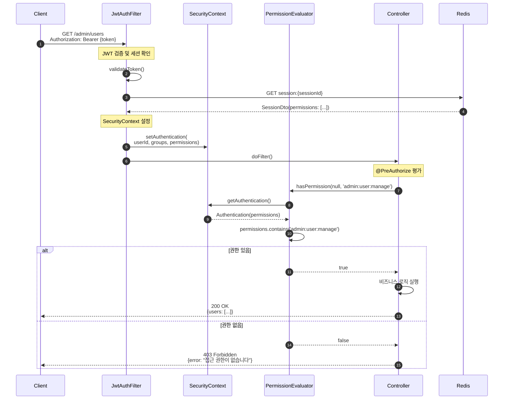
```mermaid
sequenceDiagram
    autonumber
    participant Client
    participant JwtAuthFilter
    participant SecurityContext
    participant PermissionEvaluator
    participant Controller
    participant Redis

    Client->>JwtAuthFilter: GET /admin/users<br/>Authorization: Bearer {token}

    Note over JwtAuthFilter: JWT 검증 및 세션 확인
    JwtAuthFilter->>JwtAuthFilter: validateToken()
    JwtAuthFilter->>Redis: GET session:{sessionId}
    Redis-->>JwtAuthFilter: SessionDto(permissions: [...])

    Note over JwtAuthFilter: SecurityContext 설정
    JwtAuthFilter->>SecurityContext: setAuthentication(<br/>userId, groups, permissions)

    JwtAuthFilter->>Controller: doFilter()

    Note over Controller: @PreAuthorize 평가
    Controller->>PermissionEvaluator: hasPermission(null, 'admin:user:manage')

    PermissionEvaluator->>SecurityContext: getAuthentication()
    SecurityContext-->>PermissionEvaluator: Authentication(permissions)

    PermissionEvaluator->>PermissionEvaluator: permissions.contains('admin:user:manage')

    alt 권한 있음
        PermissionEvaluator-->>Controller: true
        Controller->>Controller: 비즈니스 로직 실행
        Controller-->>Client: 200 OK<br/>{users: [...]}
    else 권한 없음
        PermissionEvaluator-->>Controller: false
        Controller-->>Client: 403 Forbidden<br/>{error: "접근 권한이 없습니다"}
    end
```

---

## Phase 4: OAuth2 Authorization Server

### 4.1 Authorization Code Flow

authorize·로그인·동의는 브라우저 체인(세션 쿠키 `SKELETON_SESSION` + CSRF)을 탄다. Bearer 헤더는 이 경로에서 읽히지 않는다.

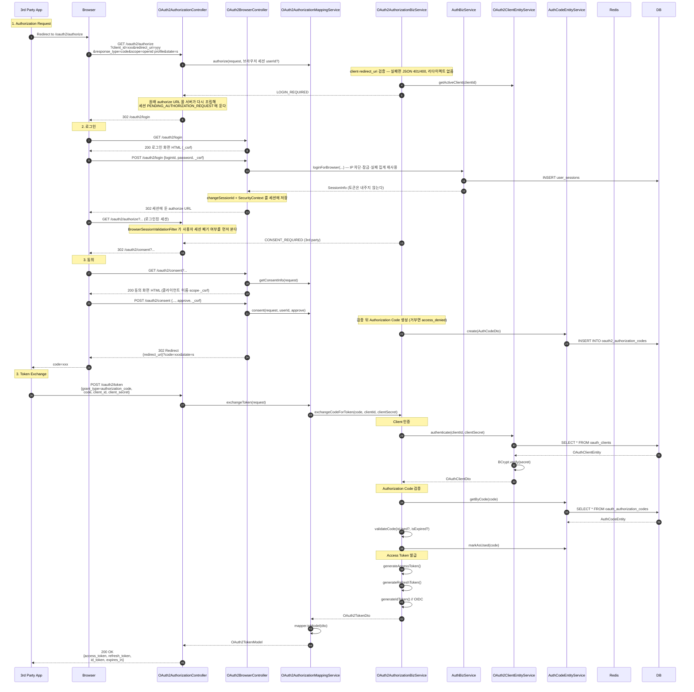
```mermaid
sequenceDiagram
    autonumber
    participant ThirdPartyApp as 3rd Party App
    participant Browser
    participant OAuth2AuthController as OAuth2AuthorizationController
    participant OAuth2BrowserController
    participant OAuth2AuthMappingService as OAuth2AuthorizationMappingService
    participant OAuth2AuthorizationBizService
    participant AuthBizService
    participant OAuth2ClientEntityService
    participant AuthCodeEntityService
    participant Redis
    participant DB

    Note over ThirdPartyApp: 1. Authorization Request
    ThirdPartyApp->>Browser: Redirect to /oauth2/authorize
    Browser->>OAuth2AuthController: GET /oauth2/authorize<br/>?client_id=xxx&redirect_uri=yyy<br/>&response_type=code&scope=openid profile&state=s

    OAuth2AuthController->>OAuth2AuthMappingService: authorize(request, 브라우저 세션 userId?)
    Note over OAuth2AuthorizationBizService: client·redirect_uri 검증 — 실패면 JSON 401/400, 리다이렉트 없음
    OAuth2AuthorizationBizService->>OAuth2ClientEntityService: getActiveClient(clientId)
    OAuth2AuthorizationBizService-->>OAuth2AuthController: LOGIN_REQUIRED
    Note over OAuth2AuthController: 원래 authorize URL 을 서버가 다시 조립해<br/>세션 PENDING_AUTHORIZATION_REQUEST 에 둔다
    OAuth2AuthController-->>Browser: 302 /oauth2/login

    Note over Browser: 2. 로그인
    Browser->>OAuth2BrowserController: GET /oauth2/login
    OAuth2BrowserController-->>Browser: 200 로그인 화면 HTML (_csrf)
    Browser->>OAuth2BrowserController: POST /oauth2/login {loginId, password, _csrf}
    OAuth2BrowserController->>AuthBizService: loginForBrowser(...) — IP 차단·잠금·실패 집계 재사용
    AuthBizService->>DB: INSERT user_sessions
    AuthBizService-->>OAuth2BrowserController: SessionInfo (토큰은 내주지 않는다)
    Note over OAuth2BrowserController: changeSessionId + SecurityContext 를 세션에 저장
    OAuth2BrowserController-->>Browser: 302 세션에 둔 authorize URL

    Browser->>OAuth2AuthController: GET /oauth2/authorize?... (로그인된 세션)
    Note over OAuth2AuthController: BrowserSessionValidationFilter 가 사용자 세션 폐기 여부를 먼저 본다
    OAuth2AuthorizationBizService-->>OAuth2AuthController: CONSENT_REQUIRED (3rd party)
    OAuth2AuthController-->>Browser: 302 /oauth2/consent?...

    Note over Browser: 3. 동의
    Browser->>OAuth2BrowserController: GET /oauth2/consent?...
    OAuth2BrowserController->>OAuth2AuthMappingService: getConsentInfo(request)
    OAuth2BrowserController-->>Browser: 200 동의 화면 HTML (클라이언트 이름·scope·_csrf)
    Browser->>OAuth2BrowserController: POST /oauth2/consent {..., approve, _csrf}
    OAuth2BrowserController->>OAuth2AuthMappingService: consent(request, userId, approve)

    Note over OAuth2AuthorizationBizService: 검증 뒤 Authorization Code 생성 (거부면 access_denied)
    OAuth2AuthorizationBizService->>AuthCodeEntityService: create(AuthCodeDto)
    AuthCodeEntityService->>DB: INSERT INTO oauth2_authorization_codes

    OAuth2BrowserController-->>Browser: 302 Redirect<br/>{redirect_uri}?code=xxx&state=s

    Browser-->>ThirdPartyApp: code=xxx

    Note over ThirdPartyApp: 3. Token Exchange
    ThirdPartyApp->>OAuth2AuthController: POST /oauth2/token<br/>{grant_type=authorization_code,<br/>code, client_id, client_secret}

    OAuth2AuthController->>OAuth2AuthMappingService: exchangeToken(request)
    OAuth2AuthMappingService->>OAuth2AuthorizationBizService: exchangeCodeForToken(code, clientId, clientSecret)

    Note over OAuth2AuthorizationBizService: Client 인증
    OAuth2AuthorizationBizService->>OAuth2ClientEntityService: authenticate(clientId, clientSecret)
    OAuth2ClientEntityService->>DB: SELECT * FROM oauth_clients
    DB-->>OAuth2ClientEntityService: OAuthClientEntity
    OAuth2ClientEntityService->>OAuth2ClientEntityService: BCrypt.verify(secret)
    OAuth2ClientEntityService-->>OAuth2AuthorizationBizService: OAuthClientDto

    Note over OAuth2AuthorizationBizService: Authorization Code 검증
    OAuth2AuthorizationBizService->>AuthCodeEntityService: getByCode(code)
    AuthCodeEntityService->>DB: SELECT * FROM oauth_authorization_codes
    DB-->>AuthCodeEntityService: AuthCodeEntity

    OAuth2AuthorizationBizService->>OAuth2AuthorizationBizService: validateCode(isUsed?, isExpired?)
    OAuth2AuthorizationBizService->>AuthCodeEntityService: markAsUsed(code)

    Note over OAuth2AuthorizationBizService: Access Token 발급
    OAuth2AuthorizationBizService->>OAuth2AuthorizationBizService: generateAccessToken()
    OAuth2AuthorizationBizService->>OAuth2AuthorizationBizService: generateRefreshToken()
    OAuth2AuthorizationBizService->>OAuth2AuthorizationBizService: generateIdToken() // OIDC

    OAuth2AuthorizationBizService-->>OAuth2AuthMappingService: OAuth2TokenDto
    OAuth2AuthMappingService->>OAuth2AuthMappingService: mapper.toModel(dto)
    OAuth2AuthMappingService-->>OAuth2AuthController: OAuth2TokenModel
    OAuth2AuthController-->>ThirdPartyApp: 200 OK<br/>{access_token, refresh_token,<br/>id_token, expires_in}
```

### 4.2 Client Credentials Flow

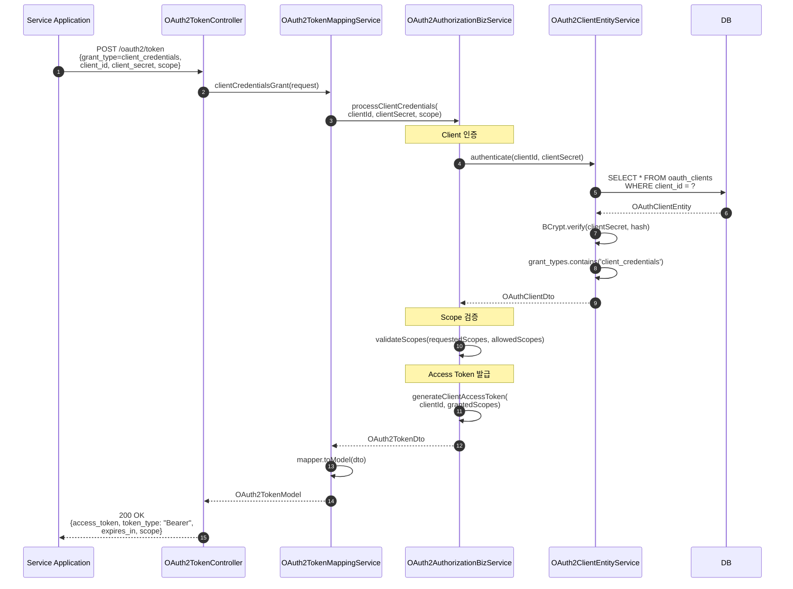
```mermaid
sequenceDiagram
    autonumber
    participant ServiceApp as Service Application
    participant OAuth2TokenController
    participant OAuth2TokenMappingService
    participant OAuth2AuthorizationBizService
    participant OAuth2ClientEntityService
    participant DB

    ServiceApp->>OAuth2TokenController: POST /oauth2/token<br/>{grant_type=client_credentials,<br/>client_id, client_secret, scope}

    OAuth2TokenController->>OAuth2TokenMappingService: clientCredentialsGrant(request)
    OAuth2TokenMappingService->>OAuth2AuthorizationBizService: processClientCredentials(<br/>clientId, clientSecret, scope)

    Note over OAuth2AuthorizationBizService: Client 인증
    OAuth2AuthorizationBizService->>OAuth2ClientEntityService: authenticate(clientId, clientSecret)
    OAuth2ClientEntityService->>DB: SELECT * FROM oauth_clients<br/>WHERE client_id = ?
    DB-->>OAuth2ClientEntityService: OAuthClientEntity

    OAuth2ClientEntityService->>OAuth2ClientEntityService: BCrypt.verify(clientSecret, hash)
    OAuth2ClientEntityService->>OAuth2ClientEntityService: grant_types.contains('client_credentials')
    OAuth2ClientEntityService-->>OAuth2AuthorizationBizService: OAuthClientDto

    Note over OAuth2AuthorizationBizService: Scope 검증
    OAuth2AuthorizationBizService->>OAuth2AuthorizationBizService: validateScopes(requestedScopes, allowedScopes)

    Note over OAuth2AuthorizationBizService: Access Token 발급
    OAuth2AuthorizationBizService->>OAuth2AuthorizationBizService: generateClientAccessToken(<br/>clientId, grantedScopes)

    OAuth2AuthorizationBizService-->>OAuth2TokenMappingService: OAuth2TokenDto
    OAuth2TokenMappingService->>OAuth2TokenMappingService: mapper.toModel(dto)
    OAuth2TokenMappingService-->>OAuth2TokenController: OAuth2TokenModel
    OAuth2TokenController-->>ServiceApp: 200 OK<br/>{access_token, token_type: "Bearer",<br/>expires_in, scope}
```

### 4.3 Token Introspection

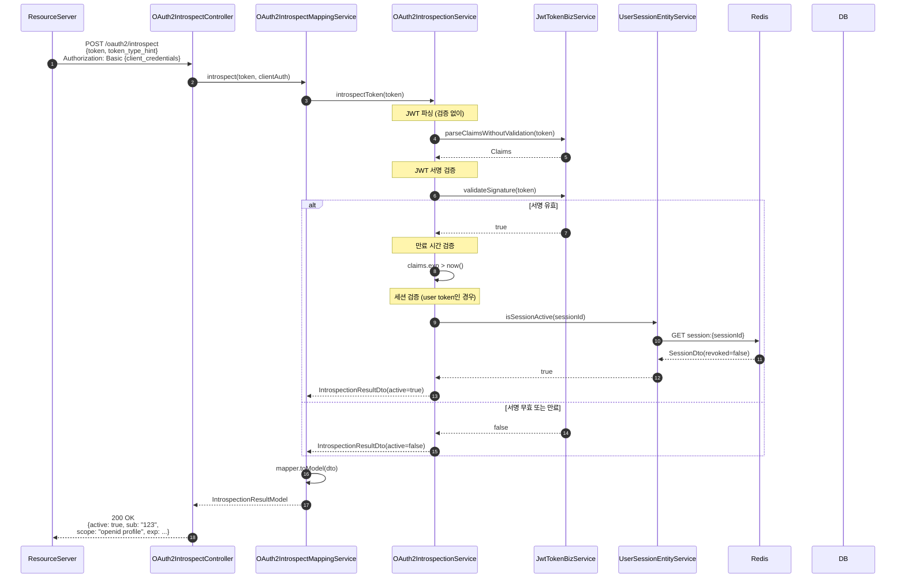
```mermaid
sequenceDiagram
    autonumber
    participant ResourceServer
    participant OAuth2IntrospectController
    participant OAuth2IntrospectMappingService
    participant OAuth2IntrospectionService
    participant JwtTokenBizService
    participant UserSessionEntityService
    participant Redis
    participant DB

    ResourceServer->>OAuth2IntrospectController: POST /oauth2/introspect<br/>{token, token_type_hint}<br/>Authorization: Basic {client_credentials}

    OAuth2IntrospectController->>OAuth2IntrospectMappingService: introspect(token, clientAuth)
    OAuth2IntrospectMappingService->>OAuth2IntrospectionService: introspectToken(token)

    Note over OAuth2IntrospectionService: JWT 파싱 (검증 없이)
    OAuth2IntrospectionService->>JwtTokenBizService: parseClaimsWithoutValidation(token)
    JwtTokenBizService-->>OAuth2IntrospectionService: Claims

    Note over OAuth2IntrospectionService: JWT 서명 검증
    OAuth2IntrospectionService->>JwtTokenBizService: validateSignature(token)

    alt 서명 유효
        JwtTokenBizService-->>OAuth2IntrospectionService: true

        Note over OAuth2IntrospectionService: 만료 시간 검증
        OAuth2IntrospectionService->>OAuth2IntrospectionService: claims.exp > now()

        Note over OAuth2IntrospectionService: 세션 검증 (user token인 경우)
        OAuth2IntrospectionService->>UserSessionEntityService: isSessionActive(sessionId)
        UserSessionEntityService->>Redis: GET session:{sessionId}
        Redis-->>UserSessionEntityService: SessionDto(revoked=false)
        UserSessionEntityService-->>OAuth2IntrospectionService: true

        OAuth2IntrospectionService-->>OAuth2IntrospectMappingService: IntrospectionResultDto(active=true)
    else 서명 무효 또는 만료
        JwtTokenBizService-->>OAuth2IntrospectionService: false
        OAuth2IntrospectionService-->>OAuth2IntrospectMappingService: IntrospectionResultDto(active=false)
    end

    OAuth2IntrospectMappingService->>OAuth2IntrospectMappingService: mapper.toModel(dto)
    OAuth2IntrospectMappingService-->>OAuth2IntrospectController: IntrospectionResultModel
    OAuth2IntrospectController-->>ResourceServer: 200 OK<br/>{active: true, sub: "123",<br/>scope: "openid profile", exp: ...}
```

---

## Phase 5: 보안 강화 및 감사

### 5.1 OIDC UserInfo

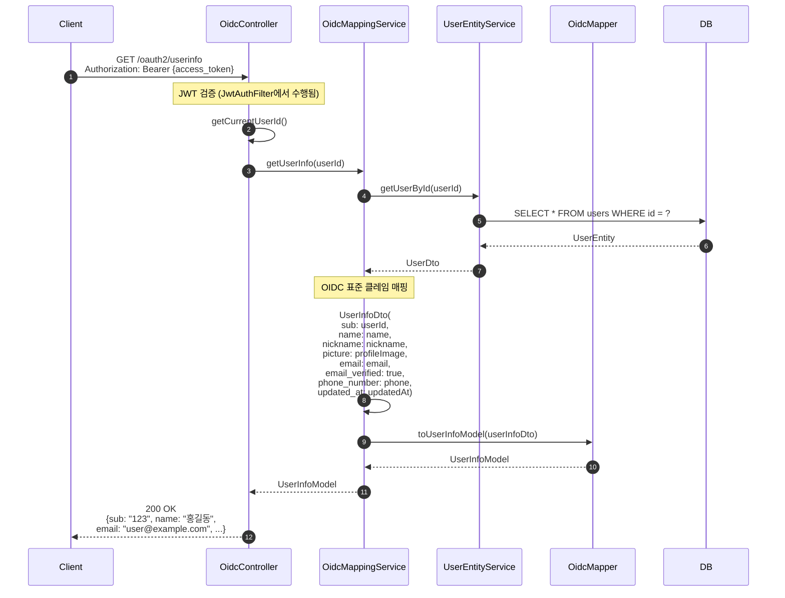
```mermaid
sequenceDiagram
    autonumber
    participant Client
    participant OidcController
    participant OidcMappingService
    participant UserEntityService
    participant OidcMapper
    participant DB

    Client->>OidcController: GET /oauth2/userinfo<br/>Authorization: Bearer {access_token}

    Note over OidcController: JWT 검증 (JwtAuthFilter에서 수행됨)
    OidcController->>OidcController: getCurrentUserId()

    OidcController->>OidcMappingService: getUserInfo(userId)
    OidcMappingService->>UserEntityService: getUserById(userId)
    UserEntityService->>DB: SELECT * FROM users WHERE id = ?
    DB-->>UserEntityService: UserEntity
    UserEntityService-->>OidcMappingService: UserDto

    Note over OidcMappingService: OIDC 표준 클레임 매핑
    OidcMappingService->>OidcMappingService: UserInfoDto(<br/>sub: userId,<br/>name: name,<br/>nickname: nickname,<br/>picture: profileImage,<br/>email: email,<br/>email_verified: true,<br/>phone_number: phone,<br/>updated_at: updatedAt)

    OidcMappingService->>OidcMapper: toUserInfoModel(userInfoDto)
    OidcMapper-->>OidcMappingService: UserInfoModel

    OidcMappingService-->>OidcController: UserInfoModel
    OidcController-->>Client: 200 OK<br/>{sub: "123", name: "홍길동",<br/>email: "user@example.com", ...}
```

### 5.2 JWK Set 조회

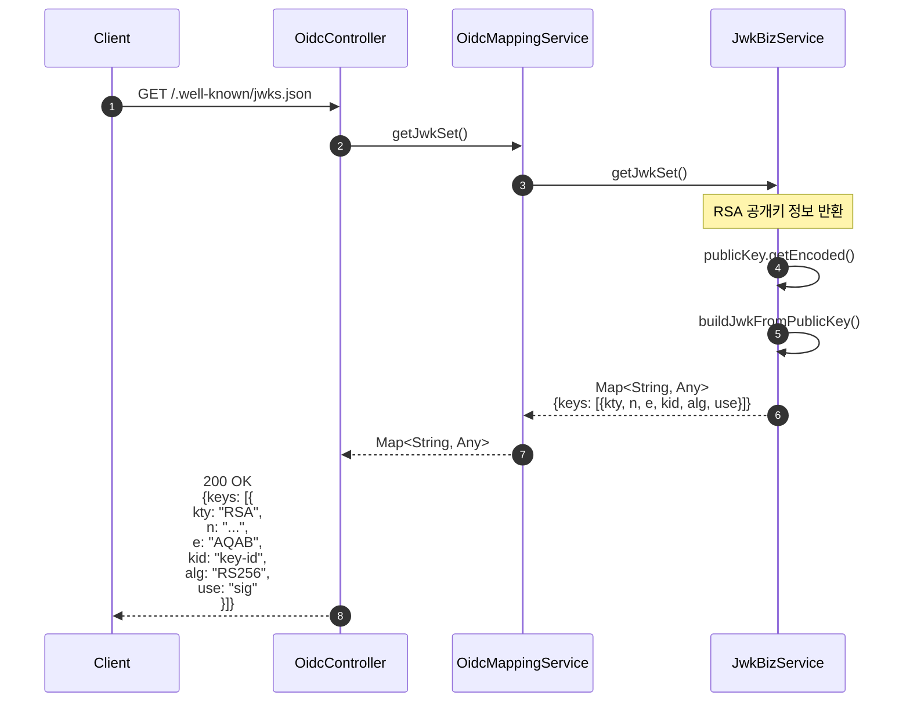
```mermaid
sequenceDiagram
    autonumber
    participant Client
    participant OidcController
    participant OidcMappingService
    participant JwkBizService

    Client->>OidcController: GET /.well-known/jwks.json

    OidcController->>OidcMappingService: getJwkSet()
    OidcMappingService->>JwkBizService: getJwkSet()

    Note over JwkBizService: RSA 공개키 정보 반환
    JwkBizService->>JwkBizService: publicKey.getEncoded()
    JwkBizService->>JwkBizService: buildJwkFromPublicKey()

    JwkBizService-->>OidcMappingService: Map<String, Any><br/>{keys: [{kty, n, e, kid, alg, use}]}
    OidcMappingService-->>OidcController: Map<String, Any>
    OidcController-->>Client: 200 OK<br/>{keys: [{<br/>  kty: "RSA",<br/>  n: "...",<br/>  e: "AQAB",<br/>  kid: "key-id",<br/>  alg: "RS256",<br/>  use: "sig"<br/>}]}
```

### 5.3 감사 로그 기록

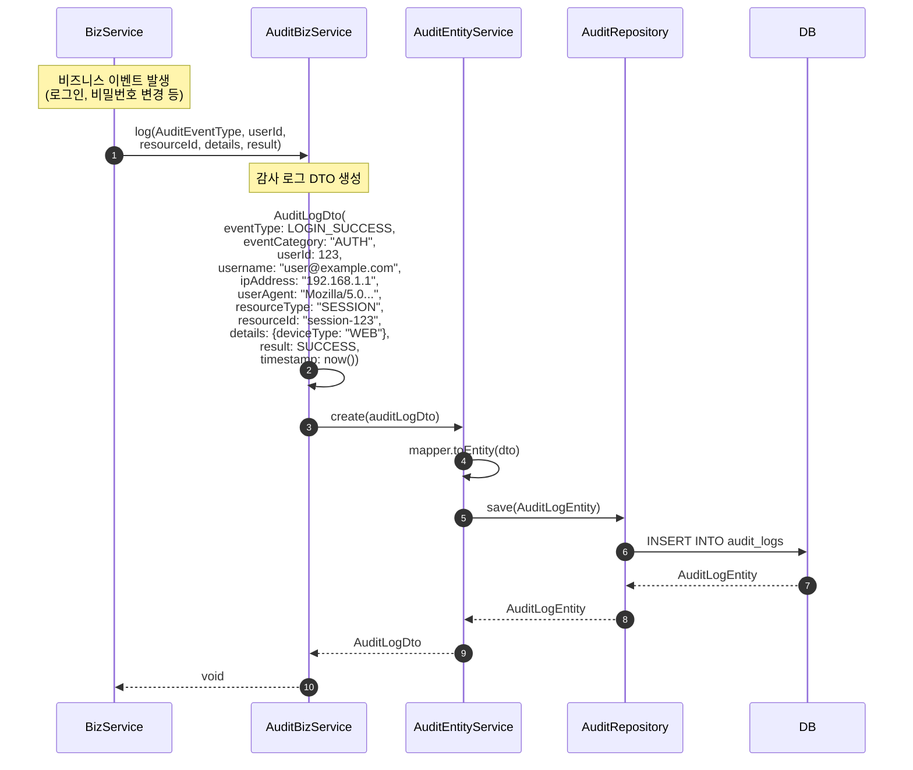
```mermaid
sequenceDiagram
    autonumber
    participant BizService
    participant AuditBizService
    participant AuditEntityService
    participant AuditRepository
    participant DB

    Note over BizService: 비즈니스 이벤트 발생<br/>(로그인, 비밀번호 변경 등)

    BizService->>AuditBizService: log(AuditEventType, userId,<br/>resourceId, details, result)

    Note over AuditBizService: 감사 로그 DTO 생성
    AuditBizService->>AuditBizService: AuditLogDto(<br/>eventType: LOGIN_SUCCESS,<br/>eventCategory: "AUTH",<br/>userId: 123,<br/>username: "user@example.com",<br/>ipAddress: "192.168.1.1",<br/>userAgent: "Mozilla/5.0...",<br/>resourceType: "SESSION",<br/>resourceId: "session-123",<br/>details: {deviceType: "WEB"},<br/>result: SUCCESS,<br/>timestamp: now())

    AuditBizService->>AuditEntityService: create(auditLogDto)
    AuditEntityService->>AuditEntityService: mapper.toEntity(dto)
    AuditEntityService->>AuditRepository: save(AuditLogEntity)
    AuditRepository->>DB: INSERT INTO audit_logs
    DB-->>AuditRepository: AuditLogEntity
    AuditRepository-->>AuditEntityService: AuditLogEntity
    AuditEntityService-->>AuditBizService: AuditLogDto

    AuditBizService-->>BizService: void
```

### 5.4 로그인 시도 제한

```mermaid
sequenceDiagram
    autonumber
    participant Client
    participant AuthController
    participant AuthMappingService
    participant AuthBizService
    participant LoginAttemptBizService
    participant BlockedIpEntityService
    participant AuditBizService
    participant Redis
    participant DB

    Client->>AuthController: POST /auth/login<br/>{loginId, password}
    AuthController->>AuthMappingService: login(request, ipAddress)
    AuthMappingService->>AuthBizService: login(loginDto, ipAddress)

    Note over AuthBizService: IP 차단 확인
    AuthBizService->>LoginAttemptBizService: isIpBlocked(ipAddress)
    LoginAttemptBizService->>BlockedIpEntityService: isBlocked(ipAddress)
    BlockedIpEntityService->>DB: SELECT * FROM blocked_ips<br/>WHERE ip_address = ? AND is_active = 1
    DB-->>BlockedIpEntityService: null (차단 안됨)
    BlockedIpEntityService-->>LoginAttemptBizService: false
    LoginAttemptBizService-->>AuthBizService: false

    Note over AuthBizService: 사용자 계정 잠금 확인
    AuthBizService->>LoginAttemptBizService: isUserLocked(loginId)
    LoginAttemptBizService->>Redis: GET login:locked:{loginId}
    Redis-->>LoginAttemptBizService: null (잠금 안됨)
    LoginAttemptBizService-->>AuthBizService: false

    Note over AuthBizService: 로그인 시도 횟수 확인
    AuthBizService->>LoginAttemptBizService: getCurrentAttempts(loginId)
    LoginAttemptBizService->>Redis: GET login:attempts:{loginId}
    Redis-->>LoginAttemptBizService: 3 (현재 시도 횟수)
    LoginAttemptBizService-->>AuthBizService: 3

    Note over AuthBizService: 비밀번호 검증 (실패 가정)
    AuthBizService->>AuthBizService: BCrypt.checkpw() → false

    Note over AuthBizService: 실패 기록
    AuthBizService->>LoginAttemptBizService: recordFailedAttempt(loginId, ipAddress)
    LoginAttemptBizService->>Redis: INCR login:attempts:{loginId}
    Redis-->>LoginAttemptBizService: 4
    LoginAttemptBizService->>Redis: EXPIRE login:attempts:{loginId} 900

    Note over LoginAttemptBizService: 임계값 확인 (max: 5)
    LoginAttemptBizService->>LoginAttemptBizService: attempts >= maxAttempts?

    alt 임계값 미달 (4 < 5)
        LoginAttemptBizService-->>AuthBizService: void
        AuthBizService->>AuditBizService: log(LOGIN_FAILURE, remainingAttempts: 1)
        AuthBizService-->>AuthMappingService: throw BadCredentialsException<br/>"남은 시도 횟수: 1회"
    else 임계값 도달 (5 >= 5)
        Note over LoginAttemptBizService: 계정 잠금
        LoginAttemptBizService->>Redis: SET login:locked:{loginId} 1<br/>EX 1800 (30분)
        LoginAttemptBizService->>AuditBizService: log(ACCOUNT_LOCKED, duration: 30min)
        LoginAttemptBizService-->>AuthBizService: void
        AuthBizService-->>AuthMappingService: throw AccountLockedException<br/>"계정이 30분간 잠겼습니다"
    end

    AuthMappingService-->>AuthController: throw Exception
    AuthController-->>Client: 401/423<br/>{error: "인증 실패", remainingAttempts: N}
```

### 5.5 IP 차단

```mermaid
sequenceDiagram
    autonumber
    participant Client
    participant AdminSecurityController
    participant SecurityMappingService
    participant BlockedIpEntityService
    participant AuditBizService
    participant SecurityMapper
    participant DB

    Client->>AdminSecurityController: POST /admin/security/blocked-ips<br/>{ipAddress, reason, durationMinutes}

    Note over AdminSecurityController: 권한 확인
    AdminSecurityController->>AdminSecurityController: @PreAuthorize('admin:security:manage')

    AdminSecurityController->>SecurityMappingService: blockIp(request, blockedBy)

    Note over SecurityMappingService: 만료 시간 계산
    SecurityMappingService->>SecurityMappingService: expiresAt = now() + durationMinutes

    Note over SecurityMappingService: Entity 생성
    SecurityMappingService->>SecurityMappingService: BlockedIpEntity(<br/>ipAddress, blockReason,<br/>description, expiresAt, blockedBy)

    SecurityMappingService->>BlockedIpEntityService: createFromEntity(entity)
    BlockedIpEntityService->>DB: INSERT INTO blocked_ips
    DB-->>BlockedIpEntityService: BlockedIpEntity
    BlockedIpEntityService->>BlockedIpEntityService: mapper.toDto(entity)
    BlockedIpEntityService-->>SecurityMappingService: BlockedIpDto

    SecurityMappingService->>SecurityMapper: toModel(dto)
    SecurityMapper-->>SecurityMappingService: BlockedIpModel

    SecurityMappingService->>AuditBizService: log(IP_BLOCKED, ipAddress)

    SecurityMappingService-->>AdminSecurityController: BlockedIpModel
    AdminSecurityController-->>Client: 201 Created<br/>{id, ipAddress, reason,<br/>expiresAt, blockedBy}
```

### 5.6 사용자 프로필 관리

```mermaid
sequenceDiagram
    autonumber
    participant Client
    participant UserSelfController
    participant UserSelfMappingService
    participant UserSelfService
    participant UserEntityService
    participant AuthMapper
    participant AuditBizService
    participant DB

    Client->>UserSelfController: GET /users/me/profile
    UserSelfController->>UserSelfController: getCurrentUserId()

    UserSelfController->>UserSelfMappingService: getProfile(userId)
    UserSelfMappingService->>UserSelfService: getProfile(userId)
    UserSelfService->>UserEntityService: getUserById(userId)
    UserEntityService->>DB: SELECT * FROM users WHERE id = ?
    DB-->>UserEntityService: UserEntity
    UserEntityService-->>UserSelfService: UserDto
    UserSelfService-->>UserSelfMappingService: UserProfileDto

    UserSelfMappingService->>AuthMapper: toUserProfileModel(dto)
    AuthMapper-->>UserSelfMappingService: UserProfileModel

    UserSelfMappingService-->>UserSelfController: UserProfileModel
    UserSelfController-->>Client: 200 OK<br/>{id, name, nickname, email, phone, profileImage}

    Note over Client: 프로필 수정
    Client->>UserSelfController: PATCH /users/me/profile<br/>{nickname, phone}
    UserSelfController->>UserSelfMappingService: updateProfile(userId, request)
    UserSelfMappingService->>UserSelfService: updateProfile(userId, updateDto)

    UserSelfService->>UserEntityService: getUserById(userId)
    UserEntityService->>DB: SELECT * FROM users
    DB-->>UserEntityService: UserEntity

    UserSelfService->>UserEntityService: update(updatedDto)
    UserEntityService->>DB: UPDATE users SET nickname=?, phone=?
    DB-->>UserEntityService: UserEntity
    UserEntityService-->>UserSelfService: UserDto

    UserSelfService->>AuditBizService: log(PROFILE_UPDATED)

    UserSelfService-->>UserSelfMappingService: UserProfileDto
    UserSelfMappingService->>AuthMapper: toUserProfileModel(dto)
    AuthMapper-->>UserSelfMappingService: UserProfileModel
    UserSelfMappingService-->>UserSelfController: UserProfileModel
    UserSelfController-->>Client: 200 OK<br/>{id, name, nickname, email, phone}
```

### 5.7 비밀번호 변경

```mermaid
sequenceDiagram
    autonumber
    participant Client
    participant UserSelfController
    participant UserSelfMappingService
    participant UserSelfService
    participant UserEntityService
    participant UserSessionEntityService
    participant AuditBizService
    participant Redis
    participant DB

    Client->>UserSelfController: POST /users/me/password/change<br/>{currentPassword, newPassword}
    UserSelfController->>UserSelfController: getCurrentUserId()

    UserSelfController->>UserSelfMappingService: changePassword(userId, request, ipAddress)
    UserSelfMappingService->>UserSelfService: changePassword(userId, dto, ipAddress)

    Note over UserSelfService: 현재 비밀번호 검증
    UserSelfService->>UserEntityService: getUserById(userId)
    UserEntityService->>DB: SELECT * FROM users
    DB-->>UserEntityService: UserEntity
    UserEntityService-->>UserSelfService: UserDto

    UserSelfService->>UserSelfService: BCrypt.checkpw(<br/>currentPassword, dto.passwordHash)

    alt 현재 비밀번호 불일치
        UserSelfService-->>UserSelfMappingService: throw BadCredentialsException
    end

    Note over UserSelfService: 새 비밀번호 해시
    UserSelfService->>UserSelfService: BCrypt.hashpw(newPassword)

    Note over UserSelfService: 비밀번호 업데이트
    UserSelfService->>UserEntityService: updatePassword(userId, newHash)
    UserEntityService->>DB: UPDATE users SET password_hash = ?
    DB-->>UserEntityService: updated

    Note over UserSelfService: 모든 세션 무효화 (보안)
    UserSelfService->>UserSessionEntityService: revokeAllByUserId(userId, "PASSWORD_CHANGED")
    UserSessionEntityService->>DB: UPDATE user_sessions<br/>SET is_revoked = 1<br/>WHERE user_id = ?
    DB-->>UserSessionEntityService: updated

    Note over UserSessionEntityService: 모든 세션 캐시 삭제
    UserSessionEntityService->>Redis: DEL session:* (해당 사용자)
    Redis-->>UserSessionEntityService: OK

    UserSelfService->>AuditBizService: log(PASSWORD_CHANGED, ipAddress)

    UserSelfService-->>UserSelfMappingService: true
    UserSelfMappingService-->>UserSelfController: true
    UserSelfController-->>Client: 200 OK<br/>{message: "비밀번호가 변경되었습니다.<br/>다시 로그인해주세요."}
```

### 5.8 세션 관리

```mermaid
sequenceDiagram
    autonumber
    participant Client
    participant UserSelfController
    participant UserSelfMappingService
    participant UserSelfService
    participant UserSessionEntityService
    participant AuthMapper
    participant Redis
    participant DB

    Note over Client: 내 세션 목록 조회
    Client->>UserSelfController: GET /users/me/sessions
    UserSelfController->>UserSelfController: getCurrentUserId(), getSessionId()

    UserSelfController->>UserSelfMappingService: getUserSessions(userId, currentSessionId)
    UserSelfMappingService->>UserSelfService: getUserSessions(userId, currentSessionId)
    UserSelfService->>UserSessionEntityService: getActiveSessionsByUserId(userId)
    UserSessionEntityService->>DB: SELECT * FROM user_sessions<br/>WHERE user_id = ? AND is_revoked = 0
    DB-->>UserSessionEntityService: List<SessionEntity>
    UserSessionEntityService-->>UserSelfService: List<SessionDto>

    Note over UserSelfService: 현재 세션 표시
    UserSelfService->>UserSelfService: sessions.map {<br/>it.copy(isCurrent = it.sessionId == currentSessionId)<br/>}

    UserSelfService-->>UserSelfMappingService: List<SessionDto>
    UserSelfMappingService->>AuthMapper: toUserSessionModel(dto)
    loop 각 SessionDto
        AuthMapper-->>UserSelfMappingService: UserSessionModel
    end
    UserSelfMappingService-->>UserSelfController: List<UserSessionModel>
    UserSelfController-->>Client: 200 OK<br/>[{id, deviceType, ipAddress,<br/>lastActivityAt, isCurrent}, ...]

    Note over Client: 특정 세션 종료
    Client->>UserSelfController: DELETE /users/me/sessions/456
    UserSelfController->>UserSelfMappingService: revokeSession(userId, sessionId, currentSessionId)

    Note over UserSelfMappingService: 현재 세션 ID null 체크
    UserSelfMappingService->>UserSelfMappingService: if currentSessionId == null return false

    UserSelfMappingService->>UserSelfService: revokeSession(userId, sessionId, currentSessionId)

    Note over UserSelfService: 본인 세션인지 확인
    UserSelfService->>UserSessionEntityService: getByIdAndUserId(sessionId, userId)
    UserSessionEntityService->>DB: SELECT * FROM user_sessions<br/>WHERE id = ? AND user_id = ?
    DB-->>UserSessionEntityService: SessionEntity

    Note over UserSelfService: 현재 세션은 종료 불가
    UserSelfService->>UserSelfService: if session.sessionId == currentSessionId<br/>throw CannotRevokeCurrentSessionException

    Note over UserSelfService: 세션 무효화
    UserSelfService->>UserSessionEntityService: revoke(sessionId, "USER_REVOKED")
    UserSessionEntityService->>DB: UPDATE user_sessions<br/>SET is_revoked = 1
    UserSessionEntityService->>Redis: DEL session:{sessionId}
    Redis-->>UserSessionEntityService: OK

    UserSelfService-->>UserSelfMappingService: true
    UserSelfMappingService-->>UserSelfController: true
    UserSelfController-->>Client: 200 OK<br/>{message: "세션이 종료되었습니다"}

    Note over Client: 다른 모든 세션 종료
    Client->>UserSelfController: DELETE /users/me/sessions<br/>(현재 세션 제외)
    UserSelfController->>UserSelfMappingService: revokeAllOtherSessions(userId, currentSessionId)
    UserSelfMappingService->>UserSelfService: revokeAllOtherSessions(userId, currentSessionId)

    UserSelfService->>UserSessionEntityService: revokeAllExcept(userId, currentSessionId)
    UserSessionEntityService->>DB: UPDATE user_sessions<br/>SET is_revoked = 1<br/>WHERE user_id = ?<br/>AND session_id != ?
    DB-->>UserSessionEntityService: updatedCount (3)

    Note over UserSessionEntityService: 해당 세션들 캐시 삭제
    UserSessionEntityService->>Redis: DEL session:{sessionId1}
    UserSessionEntityService->>Redis: DEL session:{sessionId2}
    UserSessionEntityService->>Redis: DEL session:{sessionId3}

    UserSessionEntityService-->>UserSelfService: 3
    UserSelfService-->>UserSelfMappingService: 3
    UserSelfMappingService-->>UserSelfController: 3
    UserSelfController-->>Client: 200 OK<br/>{revokedCount: 3,<br/>message: "3개의 세션이 종료되었습니다"}
```

---

## 부록: 캐시 무효화 전략

### 캐시 키 패턴

| 캐시 유형 | 키 패턴 | TTL | 무효화 시점 |
|-----------|---------|-----|-------------|
| 세션 | `session:{sessionId}` | Access Token 만료시간 | 로그아웃, 강제종료, 비밀번호 변경 |
| 세션 폐기 표식 | `session:revoked:{sessionId}` | 5분 | 만료 — 폐기 직후 늦은 캐시 쓰기를 막는다(`cacheSessionUnlessRevoked`) |
| 권한 | `user:permissions:{userId}` | 5분 | 그룹 변경, 그룹 권한 변경 |
| 로그인 시도 | `login:attempts:{loginId}` | 15분 | 로그인 성공 |
| 계정 잠금 | `login:locked:{loginId}` | 30분 | 관리자 해제, 자동 만료 |
| 소셜 state | `browser:social-state:{state}` | 5분 | 콜백이 `GETDEL` 로 소비 |
| 콜백 토큰 교환 대기 | `browser:token-handoff:{userSessionId}` | 60초 | `POST /auth/session/token` 이 `GETDEL` 로 소비 |
| 브라우저 세션 | `skeleton:public-api:session:sessions:{id}` | 30분(비활동) | 만료 |

### 이벤트별 캐시 무효화

```mermaid
flowchart TD
    A[이벤트 발생] --> B{이벤트 유형}

    B --> |로그아웃| C[session:{sessionId} 삭제]
    B --> |비밀번호 변경| D[해당 사용자 모든 session:* 삭제]
    B --> |그룹 할당/제거| E[user:permissions:{userId} 삭제<br/>해당 사용자 session:* 삭제]
    B --> |그룹 권한 변경| F[해당 그룹 소속 모든 사용자<br/>user:permissions:* 삭제<br/>session:* 삭제]
    B --> |로그인 성공| G[login:attempts:{loginId} 삭제]
    B --> |관리자 계정 해제| H[login:locked:{loginId} 삭제]
```

---

## 참고 문서

- [DESIGN.md](../DESIGN.md) - 상세 설계 문서
- [CLAUDE.md](../CLAUDE.md) - 아키텍처 가이드
- [README.md](../README.md) - 프로젝트 개요
